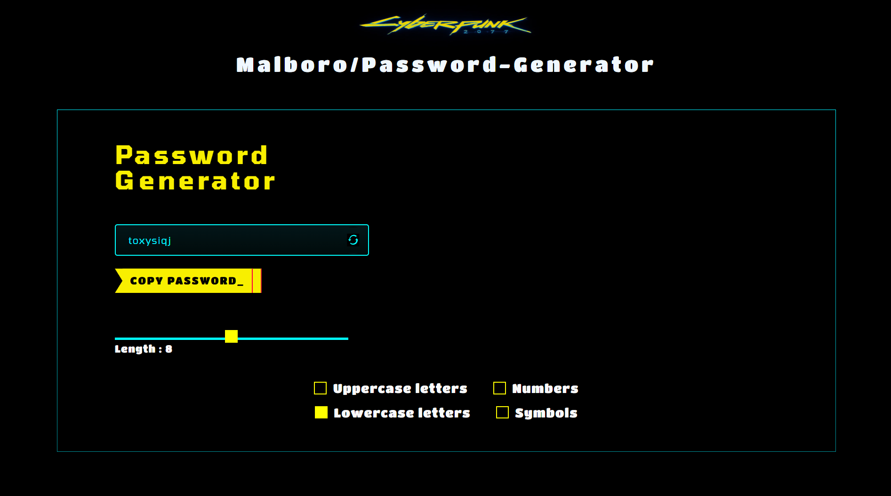

# ⚛️ Password Generator App (React)

> A slick, cyberpunk-style password generator built with **React** and mad vibes.

Generate ultra-strong passwords on the fly with customizable options — served with neon visuals and buttery-smooth UX.


<!-- Replace this with your actual screenshot path -->

---

## 🧰 Features

- 🔐 Strong password generation with customizable options
- 🎛️ Choose length, symbols, numbers, uppercase, lowercase
- 📋 One-click copy to clipboard
- ⚡ Built using React functional components + hooks
- 💅 Neon-themed, futuristic UI (custom styled)
- 🌀 Reset + Regenerate instantly

---

## 🚀 Live Demo

**[🔗 Try it here](https://shiftingParadigm.github.io/password-generator/)**  
> _Hosted via GitHub Pages (or Netlify/Vercel if deployed there)_

---

## 🛠️ Tech Stack

| Tech         | Usage                        |
|--------------|------------------------------|
| React        | UI Library                   |
| HTML/CSS     | Styling (custom, no Tailwind)|
| JavaScript   | Core logic (ES6+)            |
| Vite/CRA     | Bundler (you choose)         |

---

## 🔄 Installation & Setup

1. Clone the repo
2. Install dependencies
3. Run locally

```bash
git clone https://github.com/yourusername/password-generator.git
cd password-generator
npm install
npm run dev   # or npm start if using CRA
